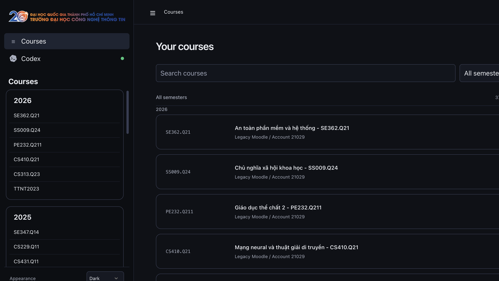
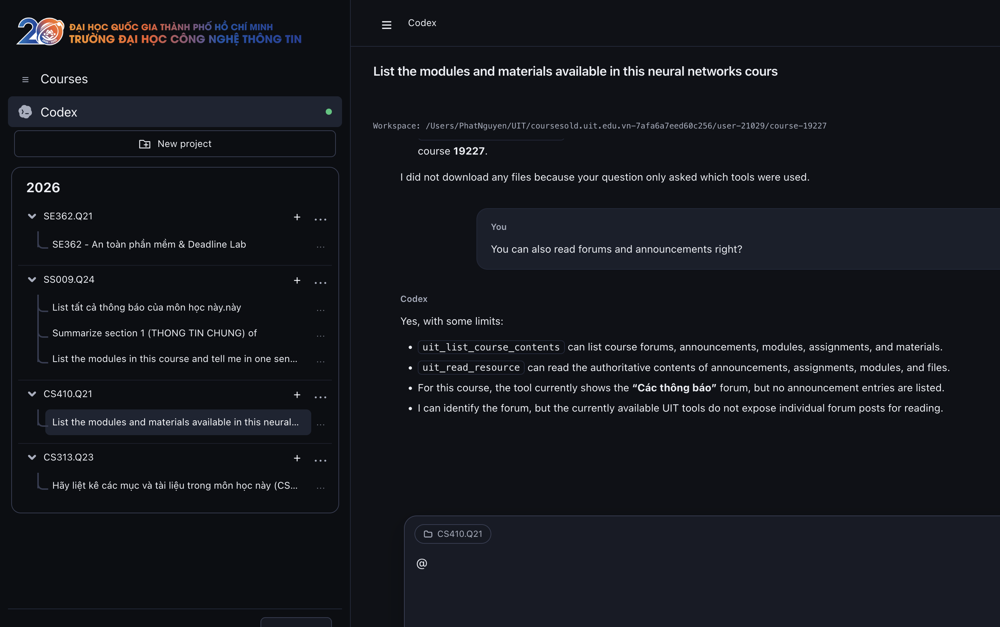

<p align="center">
  
</p>

<p align="center">
  <strong>The modern command-line tool and AI desktop workspace for UIT Moodle LMS.</strong>
</p>

---

## 1. UIT CLI

Fast, scriptable terminal client for browsing courses, checking assignments, downloading materials, and tracking grades.

### Login

`uit login` uses **UIT SSO** by default. The legacy flow still supports the v1.0/v1.1 Student ID/password login and stores only the returned Moodle token:

```bash
# UIT SSO (default; opens a browser window)
uit login

# Explicit SSO flag
uit login --sso

# Legacy Moodle: prompts for Student ID and password, then stores the token
uit login --legacy
```

`uit init` remains a backwards-compatible alias for the legacy Student ID/password flow. If you already signed in via **UIT Studio**, your SSO session is automatically shared with the CLI.

<p align="center">
  
</p>

---

## 2. UIT Studio

The native desktop workspace combining Moodle course management with an intelligent Codex AI study copilot.

### Launch

```bash
npm install -g uit-studio
uit-studio
```

The curl app install command works only on macOS and installs an unsigned app:

```bash
curl -fsSL https://raw.githubusercontent.com/RyanNg1403/uit-cli/main/scripts/install.sh | sh -s -- --studio
```

### Login

Sign in directly using **UIT SSO** (single sign-on) or your **Legacy Moodle** student account. Sessions are stored securely on your local device.

### What UIT Studio includes

- A unified dashboard for current and legacy UIT Moodle portals.
- Course materials with PDF, Word, image, text, and code previews.
- Class members, lecturers, grades, feedback, and deadlines.
- Codex study threads grounded in selected courses and resources.

<p align="center">
  
</p>

Chat with Codex using direct context from your courses, lecture slides, and assignments, then continue the same thread in Codex CLI or the ChatGPT desktop app.

<p align="center">
  
</p>

---

## Installation matrix

| Product | npm | curl | Node requirement | Supported platforms |
| :--- | :--- | :--- | :--- | :--- |
| UIT CLI | `npm install -g uit-cli` | `curl -fsSL https://raw.githubusercontent.com/RyanNg1403/uit-cli/main/scripts/install.sh \| sh` | 20.19+ for npm; none for curl | npm: macOS, Linux, Windows · curl: macOS arm64, Linux x64/arm64 |
| UIT Studio | `npm install -g uit-studio` then `uit-studio` | `curl -fsSL https://raw.githubusercontent.com/RyanNg1403/uit-cli/main/scripts/install.sh \| sh -s -- --studio` | 20.19+ for npm; none for curl | macOS arm64 (Apple Silicon) only |

## License

MIT
