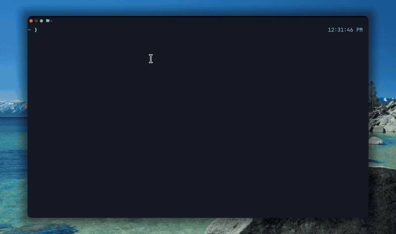
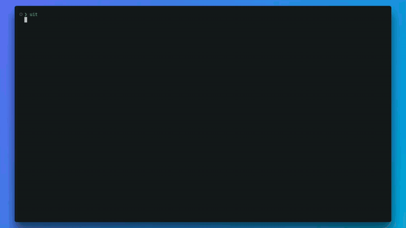

<p align="center">
  
</p>

<h1 align="center">UIT STUDIO</h1>

<p align="center">
  <strong>One workspace. Every course.</strong>
</p>

<p align="center">
  <a href="https://ryanng1403.github.io/uit-cli/">Open the UIT Studio landing page ↗</a>
</p>

---

## UIT Studio

<p align="center">
  
</p>

UIT Studio is a local course workspace for:

- browsing course materials, announcements, assignments, grades, and calendar;
- starting Codex agent threads with course context;
- free to start: [Codex CLI](https://developers.openai.com/codex/cli/) + [ChatGPT Desktop](https://chatgpt.com/download/), with ChatGPT sign-in.

Sign in with UIT SSO or a legacy Moodle account. Both installation methods launch the same local web Studio with `uit-studio`; run `uit-studio stop` to shut it down.

Agent mode requires the [Codex CLI](https://github.com/openai/codex):

```bash
npm install -g @openai/codex
codex --login
```

The ChatGPT desktop app alone is not sufficient for agent mode.

### Installation

<details>
<summary>macOS</summary>

```bash
npm install -g uit-studio
uit-studio
```

Or install the Apple Silicon native web release:

```bash
curl -fsSL https://raw.githubusercontent.com/RyanNg1403/uit-cli/main/scripts/install.sh | sh -s -- --studio
```
</details>

<details>
<summary>Linux</summary>

```bash
npm install -g uit-studio
uit-studio
```

Or install the Linux native web release:

```bash
curl -fsSL https://raw.githubusercontent.com/RyanNg1403/uit-cli/main/scripts/install.sh | sh -s -- --studio
```
</details>

<details>
<summary>Windows</summary>

Install the native web release from PowerShell:

```powershell
$installer = Join-Path $env:TEMP "uit-studio-install.ps1"
Invoke-WebRequest https://raw.githubusercontent.com/RyanNg1403/uit-cli/main/scripts/install.ps1 -OutFile $installer
powershell -ExecutionPolicy Bypass -File $installer -Studio
uit-studio
uit-studio --version
```

The npm alternative requires [Node.js 24.0+](https://nodejs.org/):

```powershell
npm install -g uit-studio
uit-studio
```

</details>

<table>
  <tr>
    <td></td>
    <td></td>
  </tr>
</table>

---

## UIT CLI

Your Moodle, at terminal speed.

The npm installation requires [Node.js 24.0+](https://nodejs.org/). Native
release packages include their own runtime.

<details>
<summary>macOS</summary>

```bash
npm install -g uit-cli
uit --version
```

Or install the signed-checksum standalone release:

```bash
curl -fsSL https://raw.githubusercontent.com/RyanNg1403/uit-cli/main/scripts/install.sh | sh
```
</details>

<details>
<summary>Linux</summary>

```bash
npm install -g uit-cli
uit --version
```

Or use the standalone release:

```bash
curl -fsSL https://raw.githubusercontent.com/RyanNg1403/uit-cli/main/scripts/install.sh | sh
```
</details>

<details>
<summary>Windows</summary>

Install [Node.js 24.0+](https://nodejs.org/), then run in PowerShell:

```powershell
npm install -g uit-cli
uit --version
```
</details>

Sign in with UIT SSO:

```bash
uit login
```

Use `uit login --legacy` for the legacy Moodle portal. An SSO session from UIT Studio is shared with the CLI.

<p align="center">
  
</p>

---

## Contributing

Contributions are welcome! Please check out our [Contributing Guidelines](.github/CONTRIBUTING.md) for details on our workflow, git conventions, and setup:

- **Git Workflow**: Always branch from the latest `main` and consolidate into `release/<version>` branches.
- **Branch Naming**: Branches must use `feat/**`, `fix/**`, `chore/**`, `proj/**`, or `release/**`.
- **Commit Conventions**: Commit messages must use a supported prefix (`feat:`, `fix:`, `chore:`, or `proj:`), enforced via local hooks and CI; the prefix does not need to match the branch name.
- **Issue & PR Templates**: Please follow our [Pull Request Template](.github/PULL_REQUEST_TEMPLATE.md) and [Issue Template](.github/ISSUE_TEMPLATE.md).

## License

MIT
