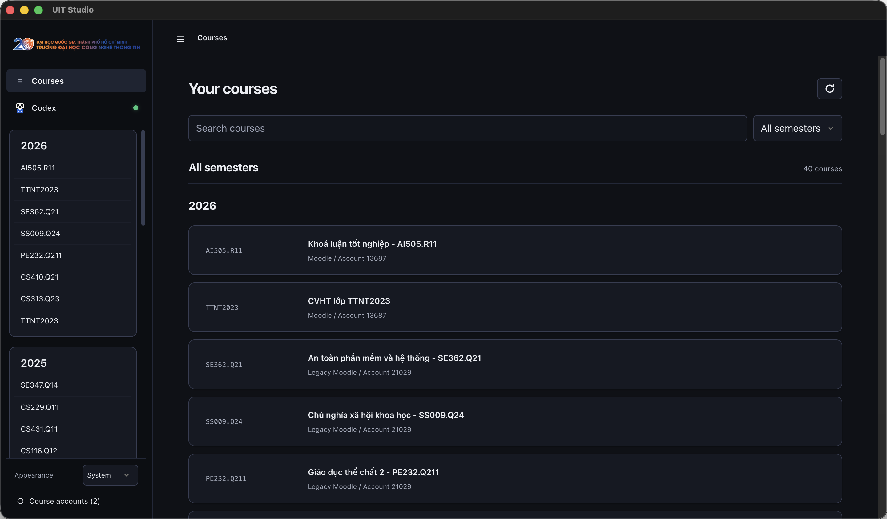
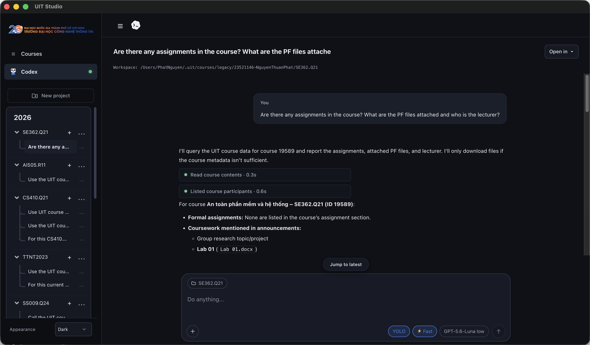

<p align="center">
  
</p>

<h1 align="center">UIT STUDIO</h1>

<p align="center">
  <strong>One workspace. Every course.</strong>
</p>

<p align="center">
  <a href="https://ryanng1403.github.io/uit-cli/">Open the UIT Studio landing page ↗</a>
</p>

---

## UIT Studio

Your course space. Built to focus.

<details>
<summary>macOS</summary>

```bash
npm install -g uit-studio
uit-studio
```

Or install the Apple Silicon macOS release app:

```bash
curl -fsSL https://raw.githubusercontent.com/RyanNg1403/uit-cli/main/scripts/install.sh | sh -s -- --studio
```
</details>

<details>
<summary>Linux</summary>

```bash
npm install -g uit-studio
uit-studio
```

Or install the Linux AppImage release:

```bash
curl -fsSL https://raw.githubusercontent.com/RyanNg1403/uit-cli/main/scripts/install.sh | sh -s -- --studio
```
</details>

<details>
<summary>Windows</summary>

Install [Node.js 20.19+](https://nodejs.org/), then run in PowerShell:

```powershell
npm install -g uit-studio
uit-studio
```

Windows release installers are also available on the [Releases page](https://github.com/RyanNg1403/uit-cli/releases).
</details>

### Agent mode requirement

Course features work without Codex. Agent mode requires the **Codex CLI**:

```bash
npm install -g @openai/codex
codex --login
```

The ChatGPT desktop app alone is not sufficient. Sign in to UIT Studio with UIT SSO or a legacy Moodle account.

<p align="center">
  
</p>

Chat with Codex using course context, then continue the same thread in Codex CLI or the ChatGPT desktop app.

<p align="center">
  
</p>

---

## UIT CLI

Your Moodle, at terminal speed.

<details>
<summary>macOS</summary>

```bash
npm install -g uit-cli
```

Or install the signed-checksum standalone release:

```bash
curl -fsSL https://raw.githubusercontent.com/RyanNg1403/uit-cli/main/scripts/install.sh | sh
```
</details>

<details>
<summary>Linux</summary>

```bash
npm install -g uit-cli
```

Or use the standalone release:

```bash
curl -fsSL https://raw.githubusercontent.com/RyanNg1403/uit-cli/main/scripts/install.sh | sh
```
</details>

<details>
<summary>Windows</summary>

Install [Node.js 20.19+](https://nodejs.org/), then run in PowerShell:

```powershell
npm install -g uit-cli
```
</details>

Sign in with UIT SSO:

```bash
uit login
```

Use `uit login --legacy` for the legacy Moodle portal. An SSO session from UIT Studio is shared with the CLI.

<p align="center">
  
</p>

---

## Contributing

Contributions are welcome! Please check out our [Contributing Guidelines](.github/CONTRIBUTING.md) for details on our workflow, git conventions, and setup:

- **Git Workflow**: Always branch from the latest `main` and consolidate into `release/<version>` branches.
- **Branch Naming**: Branches must use `feat/**`, `fix/**`, `chore/**`, `proj/**`, or `release/**`.
- **Commit Conventions**: Commit messages must use a supported prefix (`feat:`, `fix:`, `chore:`, or `proj:`), enforced via local hooks and CI; the prefix does not need to match the branch name.
- **Issue & PR Templates**: Please follow our [Pull Request Template](.github/PULL_REQUEST_TEMPLATE.md) and [Issue Template](.github/ISSUE_TEMPLATE.md).

## License

MIT
