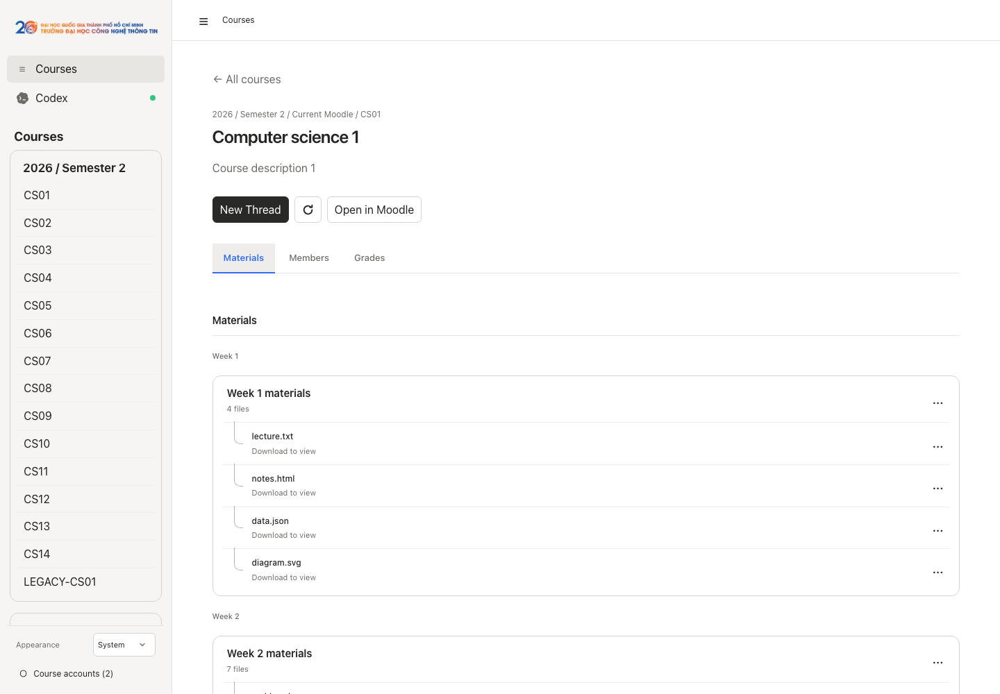
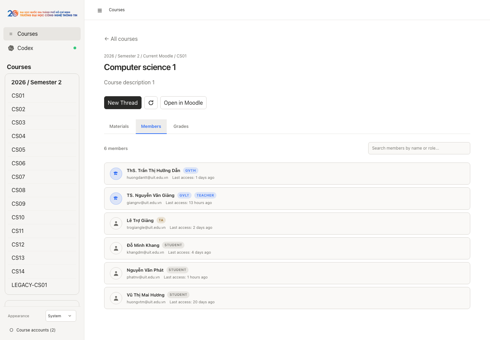
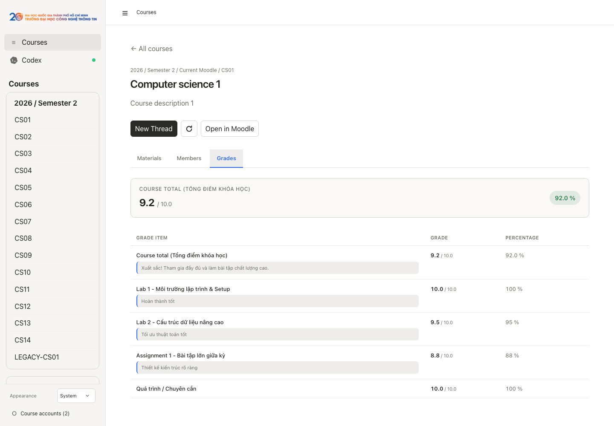

<p align="center">
  
</p>

<p align="center">
  <strong>The modern command-line tool and AI desktop workspace for UIT Moodle LMS.</strong>
</p>

---

## 1. UIT CLI

Fast, scriptable terminal client for browsing courses, checking assignments, downloading materials, and tracking grades.

### Installation

`npm` installs the CLI and MCP server only; UIT Studio is distributed separately.

```bash
npm install -g uit-cli
```

On macOS and Linux, the free installer is also available. It uses npm internally, so Node.js 20.19 or later is still required:

```bash
curl -fsSL https://raw.githubusercontent.com/RyanNg1403/uit-cli/main/scripts/install.sh | sh
```

To work from source instead:

```bash
git clone https://github.com/RyanNg1403/uit-cli.git
cd uit-cli
npm ci
npm link
```

### Login

`uit login` supports both **UIT SSO** and **Moodle API tokens**:

```bash
# Recommended: Sign in via UIT SSO in browser (default)
uit login

# Or sign in via Moodle API token
uit login --token <your_token>
```

*Tip: If you already signed in via **UIT Studio**, your SSO session is automatically shared with the CLI.*

### Basic Usage

| Command | Description |
| :--- | :--- |
| `uit courses` | List enrolled courses with course IDs |
| `uit contents <course_id>` | Browse sections, lecture slides, and files |
| `uit deadlines` | View assignment deadlines and submission status |
| `uit grades <course_id>` | Check grades, weights, and teacher feedback |
| `uit download <course_id>` | Download course materials and lecture slides |

<p align="center">
  
</p>

---

## 2. UIT Studio

The native desktop workspace combining Moodle course management with an intelligent Codex AI study copilot.

### Installation & Launch

UIT Studio is currently distributed for macOS on Apple Silicon and Intel Macs. The downloadable builds are unsigned to keep distribution free, so macOS may block the first launch. If it does, open **System Settings → Privacy & Security** and choose **Open Anyway** for UIT Studio.

Install UIT Studio into `~/Applications`:

```bash
curl -fsSL https://raw.githubusercontent.com/RyanNg1403/uit-cli/main/scripts/install.sh | sh -s -- --studio
```

Install both UIT CLI and UIT Studio:

```bash
curl -fsSL https://raw.githubusercontent.com/RyanNg1403/uit-cli/main/scripts/install.sh | sh -s -- --all
```

The installer detects the Mac architecture and verifies the release archive's SHA-256 checksum. You can also download the unsigned DMG directly from the [latest GitHub release](https://github.com/RyanNg1403/uit-cli/releases/latest).

To launch from source instead, install Node.js 20.19 or later and run:

```bash
git clone https://github.com/RyanNg1403/uit-cli.git
cd uit-cli
npm ci
npm run desktop
```

### Login

Sign in directly using **UIT SSO** (single sign-on) or your **Legacy Moodle** student account. Sessions are stored securely on your local device.

### Basic Usage & Features

#### Codex AI Study Copilot
Chat with an AI tutor that has direct context on your courses, lecture slides, and assignments. Switch models, fork study threads, and ask questions with real-time academic context.

<p align="center">
  
</p>

#### Dual Portals & Courses Dashboard
Manage courses across both **courses.uit.edu.vn** (SSO) and **coursesold.uit.edu.vn** (Legacy) grouped cleanly by academic year with instant real-time search.

<p align="center">
  
</p>

#### Course Materials, Previews & PDF Viewer
Inspect lecture slides and documents directly in-app with built-in multi-page PDF rendering, Word previews, and download shortcuts.

<p align="center">
  
</p>

#### Class Members & Lecturers
Browse your class roster with lecturers pinned at the top, complete with teacher tags and instant search.

<p align="center">
  
</p>

#### Grades & Feedback Breakdown
Track course components, weights, raw marks, and instructor feedback alongside your calculated Course Total.

<p align="center">
  
</p>

---

## License

MIT
